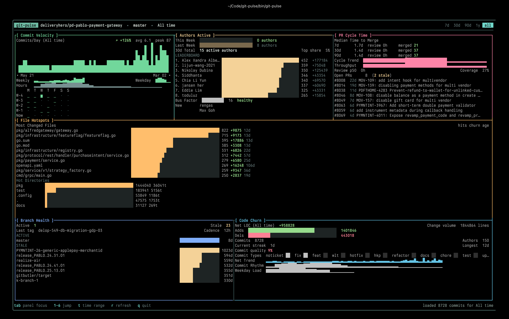

<p align="center">
  
</p>

<h1 align="center">git-pulse</h1>

<p align="center">
  <strong>A btop-style terminal dashboard for git repository analytics.</strong><br>
  Commit velocity, author stats, file hotspots, branch health, code churn, and PR cycle times — all from your terminal.
</p>

<p align="center">
  <a href="#installation">Installation</a> •
  <a href="#usage">Usage</a> •
  <a href="#configuration">Configuration</a> •
  <a href="#license">License</a>
</p>

---

## What is this?

`git-pulse` scans any git repository and renders a dense, information-rich TUI dashboard. It shows you what's actually happening in a codebase — who's active, what files are churning, how fast PRs are merging, and whether your bus factor should worry you.

Everything runs locally via `go-git`. If the repo has a GitHub remote and a `GITHUB_TOKEN`, it also pulls PR cycle time, review coverage, and throughput metrics in the background.

<p align="center">
  
</p>

## Installation

**From source** (requires Go 1.24+):

```bash
go install github.com/khzaw/git-pulse/cmd/git-pulse@latest
```

Or clone and build:

```bash
git clone https://github.com/khzaw/git-pulse.git
cd git-pulse
make build
./bin/git-pulse
```

## Usage

Run it inside any git repository:

```bash
git-pulse
```

### Non-interactive export

```bash
git-pulse --json            # JSON snapshot
git-pulse --markdown        # Markdown report
git-pulse --csv             # CSV summary
git-pulse --ci              # CI-friendly JSON
git-pulse --json --remote   # Include GitHub PR data
```

### Keyboard shortcuts

| Key | Action |
|-----|--------|
| `tab` / `shift+tab` | Cycle panel focus |
| `1`–`6` | Jump to panel |
| `t` | Cycle time window (7d → 30d → 90d → 1y → all) |
| `r` | Refresh |
| `q` | Quit |

### GitHub PR metrics

If your repo's `origin` remote points to GitHub, PR data loads automatically. Set `GITHUB_TOKEN` for higher API rate limits:

```bash
export GITHUB_TOKEN=ghp_...
git-pulse
```

## Configuration

Optional `.git-pulse.yml` in your repo root or passed via `--config`:

```yaml
repo_path: .
theme: tokyo-night
refresh_seconds: 60
default_window: 30d     # 7d | 30d | 90d | 1y | all
```

## Development

```bash
make build       # Build to ./bin/git-pulse
make test        # Run tests
make test-race   # Race detector
make fmt         # Format
make check       # fmt + test
```

## License

[MIT](./LICENSE)
